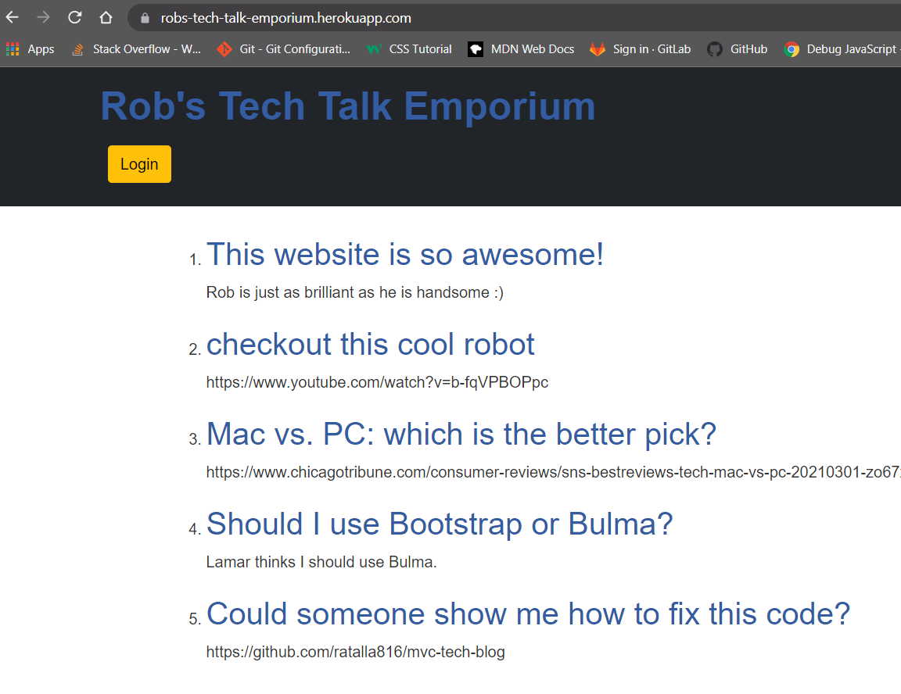

 
    
  
   
  
   
  
   
  
   
  
  

 ## Description
  
  ### USER STORY

  * GIVEN a CMS-style blog site
  * WHEN I visit the site for the first time
  * THEN I am presented with the homepage, which includes existing blog posts if  any have been posted; navigation links for the homepage and the dashboard; and the option to log in
  * WHEN I click on the homepage option
  * THEN I am taken to the homepage
  * WHEN I click on any other links in the navigation
  * THEN I am prompted to either sign up or sign in
  * WHEN I choose to sign up
  * THEN I am prompted to create a username and password
  * WHEN I click on the sign-up button
  * THEN my user credentials are saved and I am logged into the site
  * WHEN I revisit the site at a later time and choose to sign in
  * THEN I am prompted to enter my username and password
  * WHEN I am signed in to the site
  * THEN I see navigation links for the homepage, the dashboard, and the option to log out
  * WHEN I click on the homepage option in the navigation
  * THEN I am taken to the homepage and presented with existing blog posts that include the post title and the date created
  * WHEN I click on an existing blog post
  * THEN I am presented with the post title, contents, post creator’s username, and date created for that post and have the option to leave a comment
  * WHEN I enter a comment and click on the submit button while signed in
  * THEN the comment is saved and the post is updated to display the comment, the comment creator’s username, and the date created
  * WHEN I click on the dashboard option in the navigation
  * THEN I am taken to the dashboard and presented with any blog posts I have already created and the option to add a new blog post
  * WHEN I click on the button to add a new blog post
  * THEN I am prompted to enter both a title and contents for my blog post
  * WHEN I click on the button to create a new blog post
  * THEN the title and contents of my post are saved and I am taken back to an updated dashboard with my new blog post
  * WHEN I click on one of my existing posts in the dashboard
  * THEN I am able to delete or update my post and taken back to an updated dashboard
  * WHEN I click on the logout option in the navigation
  * THEN I am signed out of the site
  * WHEN I am idle on the site for more than a set time
  * THEN I am able to view comments but I am prompted to log in again before I can add, update, or delete comments
   
  ## Table of Contents
  - [Description](#description)
  - [Documentation](#documentation)
  - [Deployment](#deployment)
  - [Walkthrough](#walkthrough)
  - [Screenshot](#screenshot)
  - [Features](#features)
  - [Acknowledgements](#acknowledgements)
  - [License](#license)
  - [Testing](#testing)
  - [Contact](#contact)

  ## Documentation
  insomnia <https://docs.insomnia.rest/>
   
  express <http://expressjs.com/en/guide/routing.html>
   
  jawsDB <https://www.jawsdb.com/docs/>
   
  mysql <https://dev.mysql.com/doc/>
   
  dotenv <https://www.npmjs.com/package/dotenv>
   
  sequelize <https://sequelize.org/master/>
   
  handlebars <https://handlebarsjs.com/guide/>
  

  
  ## Deployment
  
  Deployed Application:  <https://robs-tech-talk-emporium.herokuapp.com/>
  ## Walkthrough

  * View the walkthrough video here: <https://watch.screencastify.com/v/9mrny3QkdpKYAn1TwBss>
  
  ## Screenshot
  

  ## Features
  Technologies used include: sequelize, dotenv, mysql, handlebars, jawsDB, insomnia, and express. 
  Login credentials are hidden from the public by storing them in an .env file. 
  Users are automatically logged out after five minutes of inactivity.
  Users have the ability to sign up for an account, then they are able to sign in and sign out. 
  Users can create blog posts which they can later edit and or delete. 
  Users are able to leave comments on their own posts and other user's posts. 
  
  # Acknowledgements
  
  * Rob Atalla
  
  * Nathan Szurek (Tutor)

  * Derimar Gray (Classmate)
  
  * KU Coding Bootcamp, Module 14 Challenge Assignment © 2021 Trilogy Education Services, LLC, a 2U, Inc. brand Confidential and Proprietary.
  All Rights Reserved.

  * KU Coding Bootcamp, Module 14 lesson activity, "Just Tech News" © 2021 Trilogy Education Services, LLC, a 2U, Inc. brand Confidential and Proprietary.
  All Rights Reserved.
  
    
  ## License
  
   
  Permission to use this application is granted under the MIT license. <https://opensource.org/licenses/MIT>

  ## Testing
  Insomnia

  ## Contact:
  Holler at me! <a href="mailto:rob.atalla@robatalla816.com">rob.atalla@robatalla816.com</a>